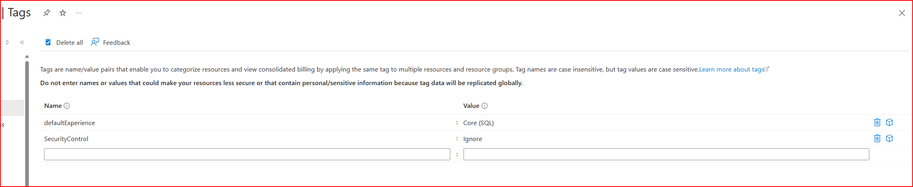

# Chatbot to support learning new languages

A Telegram bot that helps you learn German.

## Prerequisites
You need to obtain a telegram BOT API **TOKEN**.

To do so, open Telegram from your phone or laptop
Search for the account @**BotFather**

Start a new chat and type the following command: **/newbot**

The bot will respond asking you to chose a Name and then a username for your bot. For this project I have used germanLessons as name and germanLesson_bot as username

After this, the botfather will respond with your **access token**. Save this information

## Getting Started

If you don't have a virtual environment (a `.env` folder) yet, create one with the following command.

```bash
python -m venv .venv

# or if you are on macOS

python3 -m venv .venv
```

Open the command line and activate the virtual environment.

```bash
source .venv/bin/activate
```

Install the requirements listed in the requirements.txt file
```bash
pip install -r requirements.txt
```

Create a `.env` file with the following contents.

```
API_TOKEN="<TELEGRAM API TOKEN>"
OPENAI_API_KEY="<YOUR_API_KEY>"
AZURE_RESOURCE_GROUP="<YOUR_AZURE_RESOURCE_GROUP_NAME>"
COSMOS_ACCOUNT_NAME="<YOUR_COSMOSDB_ACCOUNT_NAME>"
COSMOS_ACCOUNT_URI="<YOUR_COSMOSDB_ACCOUNT_URI>"
COSMOS_ACCOUNT_KEY="<YOUR_COSMOSDB_KEY>" #primary or seconday key, NOT the connection string
LANGUAGESTUDIO_KEY="<YOUR_AZURE_LANGUAGESTUDIO_KEY>"
LANGUAGESTUDIO_ENDPOINT="<YOUR_AZURE_LANGUAGESTUDIO_ENDPOINT>"

```

**Cosmos DB configuration**
For this application, we will ebable connection to cosmos DB from all networks and enable the connection string instead of RBAC

To achieve so, run the following command (they might take a while to execute, so don't worry)
```
  az resource update \
    --resource-type "Microsoft.DocumentDB/databaseAccounts" \
    --resource-group <your-resource-group> \
    --name <your-cosmosdb-account> \
    --set properties.disableLocalAuth=false \
    --set properties.publicNetworkAccess=Enabled
```
You can find the name of your cosmos db account directly in the Azure portal or running the command ```az cosmosdb list --query "[].name"```. This name have to match the COSMOS_DB_ACCOUNT_NAME in your .env file

Following, we need to add a tag to our cosmos DB account from Azure portal or terminal

Azure portal: 


Terminal
```bash
az resource update \
  --resource-group <your-resource-group> \
  --resource-type "Microsoft.DocumentDB/databaseAccounts" \
  --name <your-cosmosdb-account-name> \
  --set tags.SecurityControl="Ignore"
  ```

## Run the bot locally
Start the bot locally with the following command.

```bash
python src/app.py
```

## Containerize the app using docker and test running container locally

**Build and tag the image**
```bash
docker build -t your-image-name:version .
```

example:
```
docker build -t yasarbao/languagelearningbot:v0.1.0 .
```

**Run the image locally**
```bash
docker run <your-image-name>
```


## Deploy to the Cloud

**Build and tag the image**
```bash
az acr login --name <your-acr-name>
docker tag your-image-name <your-acr-name>.azurecr.io/your-image-name:latest
docker push <your-acr-name>.azurecr.io/your-image-name:latest
```

example:
```
az acr login --name acr_languagelearningbot
docker tag img_languagelearningbot acr_languagelearningbot.azurecr.io/img_languagelearningbot:latest
docker push acr_languagelearningbot.azurecr.io/img_languagelearningbot:latest
```

**Create an Azure Container App using the pushed image**

Get acr credentials
```bash
az acr credential show --name <your-acr-name>
```

Create the ACA resource
```bash
az containerapp create \
  --name <your-app-name> \
  --resource-group <your-resource-group> \
  --environment <your-containerapp-env> \
  --image <your-acr-name>.azurecr.io/your-image-name:latest \
  --registry-login-server <your-acr-name>.azurecr.io \
  --registry-username <your-acr-username> \
  --registry-password <your-acr-password> \
  --ingress external
  ```

example
```
az acr credential show --name acr_languagelearningbot

az containerapp create \
  --name aca_languagelearningbot \
  --resource-group rg-learningbot-dev-ch \
  --environment env-languagelearningbot \
  --image acr_languagelearningbot.azurecr.io/img_languagelearningbot:latest \
  --registry-login-server acr_languagelearningbot.azurecr.io \
  --registry-username <your-acr-username> \
  --registry-password <your-acr-password> \
  --ingress external
```

# APPENDIX

**Create Language Studio Resource**
Link to create the resource: https://portal.azure.com/#create/Microsoft.CognitiveServicesTextAnalytics

**Create CosmosDB**
